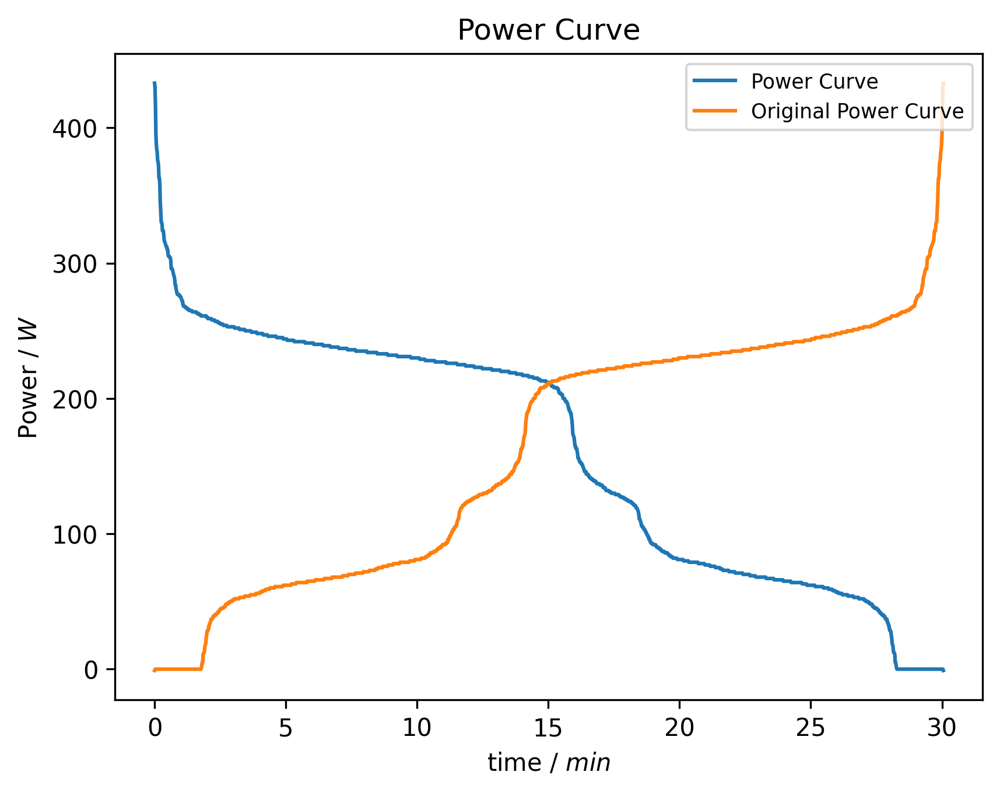

# Programmierübung 2

## Ziel des Projekts
Erstellen einer Grafik, welche die sortierten Wattzahlen mit Hilfe von Matplotlib ausgiebt (Siehe unten).

## Ergebnisgrafik

## Umgang mit PDM

- Zum Aufsetzen dieses Projekts einmalig `pdm init`
- Zum Installieren dieses Projekts nach dem clonen `pdm install`
- Zum Hinzufügen eines Pakets `pdm add <packetname>`

- `.gitignore`legt fest, welche Dateien von git ignoriert werden. Hier muss __immer vor__ dem ersten Commit der Ordner `.venv/` drin stehen.

# EKG- Analyze App

## Funktionsumfang (Lastenheft)
- Die App ermöglicht die Analyse von EKG-Daten
- Dabei werden folgende Use-Cases unterstützt:

### Funktionale Anforderungen

- [ ] Als Nutzer:in möchte ich eine Versuchsperson auswählen und die relevanten Daten angezeigt bekommen
- [ ] Als Nutzer:in möchte ich mir das Bild einer Versuchsperson anzeigen lassen, um mich zu vergewissern, dass ich die richtige Person anzeige (Termin 2)
- [ ] Als Nutzer:in möchte ich die zu einer Versuchsperson gehörenden EKG Datensätze auswählen können (sofern es mehrere gibt)
- [ ] Als Nutzer:in möchte ich die EKG-Daten einer Versuchsperson als Grafik anzeigen lassen (Termin 3)
- [ ] Als Nutzer:in möchte ich mir den Durchschnittspuls einer Versuchsperson als Zahl anzeigen lassen (Termin 4)

## Implementierung (Pflichtenheft)
### Ablaufdiagramm

[](https://mermaid.live/edit#pako:eNp9ks9y0zAQxl9FsyeYiTOWHWJXBxgg0AMXDj0RMxnV3limsuTRH0KbydvwJn0xZIfYpu2gk9f7_fb7tKMjlLpCYBBFUaFc4yQy8l5xeW-RfPpyXaihsZf6UApuHLn5UCgSjnWhekVezyoSRW8tSizdzls0269G33JVNYpwbw-Pv4VE9f2vfpL1FJGaV88g9YBNPSKjZAAEtzuH1h1DxmjDHSryUxsRSFTvTmfiooki8oMHakyHd_X2JjSe55ohCkOGHlJ6AD5j0JmnqaaJfazSYIiyqw3vtteG75s7gsY6lJPDedpwh9kSzr0ZPuxS6MM_s_7vrdvOB1qY7cabUthSqMY523lp-4saDD9GdlKPTi-DTyzPwiE-hl1PD-CSdd6CBdSmqYA543EBLZqW9yUce6gAJ7DFAlj4rHDPvXQFFOoUsI6rb1q3F9JoXwtgey5tqHxXhTVtGh78JknvaT5qrxwwmibDDGBH-AUsWcfLPEuu4jWN0zSmebqAe2D5kr7JrlZJvqardbpKktMCHgZXuoyTmGZZkmV5SuMVPf0B9AsO6w)
